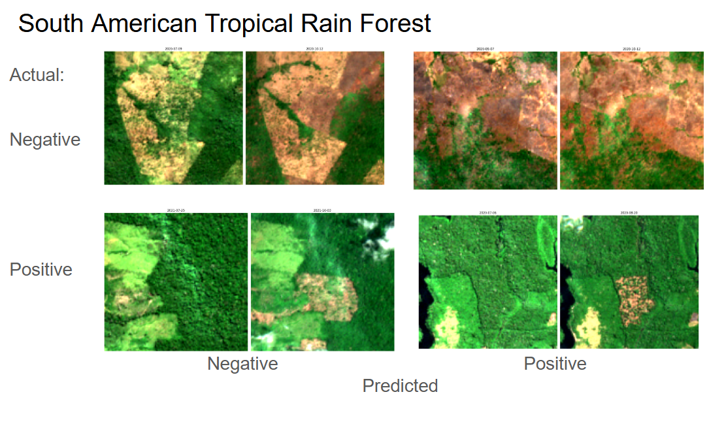
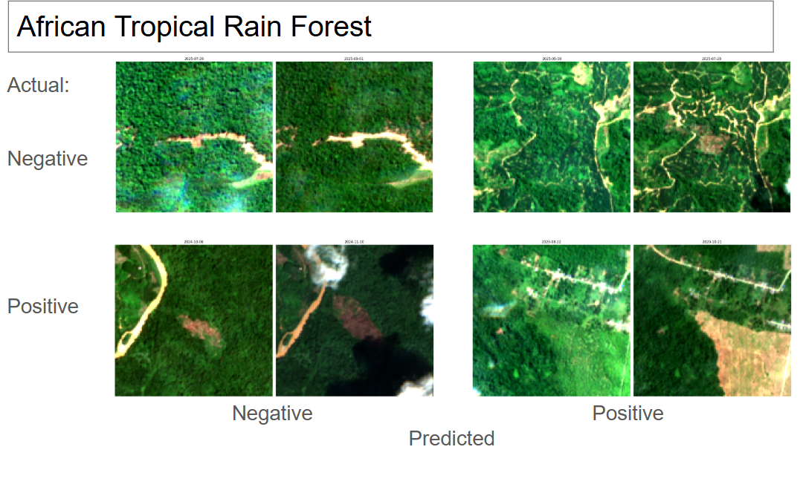
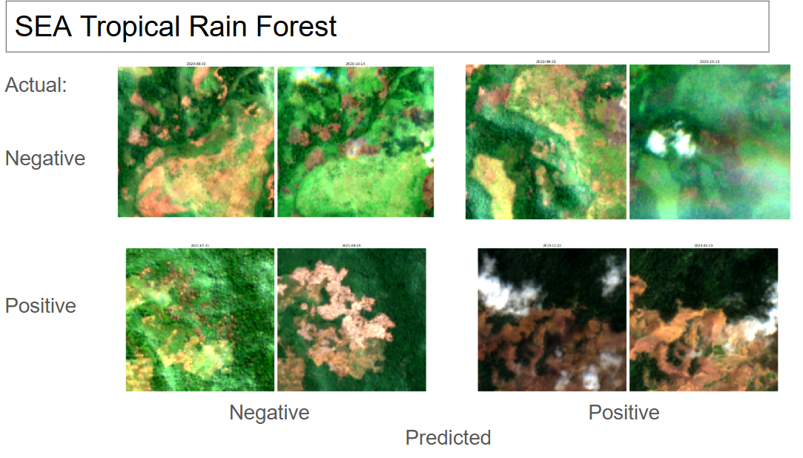

# deforestation_embedder

<a target="_blank" href="https://cookiecutter-data-science.drivendata.org/">
    
</a>

Using EO FM Embeddings for Deforestated Area detection

## Project Description

*deforestation_embedder* is a machine learning project that leverages the Copernicus-FM foundation models to detect and map deforested areas from satellite imagery. The Copernicus Foundation Model is used to generate embeddings from Sentinel-1 radar data, which are then used for the specific task of deforestation detection within the accroding image chips.


## Data Description

The project utilizes various data sources, including satellite imagery and ground truth data, to train models for burned area detection. In the following table, we summarize the key datasets used in this project:

| Dataset Name       | Description                                      | Source               |
|--------------------|--------------------------------------------------|----------------------|
| Radar Satellite Imagery  | Sentinel-1 SAR | [Microsoft Planetary Computer](https://planetarycomputer.microsoft.com/dataset/sentinel-1-rtc)          |
| Optical Satellite Imagery  | Sentinel-2 satellite imagery  (for visualization only)  | [Microsoft Planetary Computer](https://planetarycomputer.microsoft.com/dataset/sentinel-2-l2a)          |
| RADD               | Sentinel-1 derived "RAdar for Deforestation Alerts" | [Global Forest Watch](https://data.globalforestwatch.org/datasets/3c27123823a5461599fac9cb06862007_0/explore)        |
| Dynamic World V1   | near real-time LULC Dataset, 10m resolution from World Resources Institute and Google  | [Google Earth Engine](https://developers.google.com/earth-engine/datasets/catalog/GOOGLE_DYNAMICWORLD_V1#description)                |


## Key Features


## Use Cases

- Deforestation monitoring


## Workflow

```
┌─────────────────────────────────────────┐
│ 01. Data Acquisition                    │
│ • Download RADD alert tiles             │
│ • GeoJSON tile boundaries               │
│ • Per continent organization            │
└────────────────┬────────────────────────┘
                 │
                 ▼
┌─────────────────────────────────────────┐
│ 02. RADD Alert Processing               │
│ • Decode alert data                     │
│ • Connected components analysis         │
│ • Filter by size & confidence           │
│ • Extract deforestation events          │
└────────────────┬────────────────────────┘
                 │
                 ▼
┌─────────────────────────────────────────┐
│ 03. Event Consolidation                 │
│ • Combine continent samples             │
│ • Clean & deduplicate                   │
│ • Create parquet datasets               │
└────────────────┬────────────────────────┘
                 │
                 ▼
┌─────────────────────────────────────────┐
│ 04. Negative Sample Generation          │
│ • Find stable forest areas              │
│ • Match spatial distribution            │
│ • Verify no alert activity              │
└────────────────┬────────────────────────┘
                 │
                 ▼
┌─────────────────────────────────────────┐
│ 05. Sentinel Data Download              │
│ • Load Sentinel-1 (Radar)               │
│ • Filter by alert dates                 │
│ • Observations before/after             │
│ • Temporal alignment                    │
└────────────────┬────────────────────────┘
                 │
                 ▼
┌─────────────────────────────────────────┐
│ 06. Embedding Generation                │
│ • Load Copernicus-FM model              │
│ • Process S1 batch unified              │
│ • Extract embeddings                    │
│ • Save with metadata                    │
└────────────────┬────────────────────────┘
                 │
                 ▼
┌─────────────────────────────────────────┐
│ 07. Classifier Training                 │
│ • Create stratified datasets            │
│ • Train MLP classifier                  │
│ • Early stopping & validation           │
│ • Save final model                      │
└────────────────┬────────────────────────┘
                 │
                 ▼
┌─────────────────────────────────────────┐
│ Inference & Evaluation                  │
│ • Generate predictions                  │
│ • Calculate metrics                     │
│ • Create visualizations                 │
└─────────────────────────────────────────┘
```

## Main Results

Visualizations of the main results can be found in 'reports/figures/validation', as well as in the notebook 'notebooks/main.ipynb'. More Information and results will be uploaded via a presentation after the Hackathon Evaluation.


## Gallery






## Prerequisites

- Python 3.8+ (we used and recommend 3.12)
- CUDA-compatible GPU (recommended for training)
- Access to Microsoft Planetary Computer and Google Earth Engine

## Setup

### Clone the repository
`git clone https://github.com/luismaecker/deforestation_embedder`
`cd deforestation_embedder`

### Create virtual environment
`python -m venv venv`
`source venv/bin/activate`  # On Windows: `venv\Scripts\activate`

### Install dependencies
`pip install -r requirements.txt` or use `uv sync`

### Install the package in development mode
`pip install -e .`

## Project Organization

```
├── LICENSE            <- Open-source license
├── Makefile           <- Makefile with convenience commands like `make data` or `make train`
├── README.md          <- The top-level README for developers using this project.
├── data
│   ├── external       <- Data from third party sources.
│   ├── interim        <- Intermediate data that has been transformed.
│   ├── processed      <- The final, canonical data sets for modeling.
│   └── raw            <- The original, immutable data dump.
│
├── models             <- Trained and serialized models, model predictions, or model summaries
│
├── notebooks          <- Jupyter notebooks. Naming convention is a number (for ordering),
│                         followed by the name of what the notebook does, e.g.
│                         `01_preprocessing`.
│
├── pyproject.toml     <- Project configuration file with package metadata for 
│                         deforestation_embedder and configuration for tools like black
│
├── references         <- Data dictionaries, manuals, and all other explanatory materials.
│
├── reports            <- Generated analysis as HTML, PDF, LaTeX, etc.
│   └── figures        <- Generated graphics and figures to be used in reporting
│
├── requirements.txt   <- The requirements file for reproducing the analysis environment, e.g.
│                         generated with `pip freeze > requirements.txt`
│
├── setup.cfg          <- Configuration file for flake8
│
└── deforestation_embedder   <- Source code for use in this project.
    │
    ├── __init__.py             <- Makes deforestation_embedder a Python module
    │
    ├── config.py               <- Store useful variables and configuration
    │
    ├── dataset.py              <- Scripts to download or generate data
    │
    ├── features.py             <- Code to create features for modeling
    │
    ├── modeling                
    │   ├── __init__.py 
    │   ├── predict.py          <- Code to run model inference with trained models          
    │   └── train.py            <- Code to train models
    │
    └── plots.py                <- Code to create visualizations
```

--------

## Acknowledgments

- Microsoft Planetary Computer for providing accessible satellite imagery
- Google Earth Engine for Dynamic World dataset
- Global Forest Watch for RADD alerts

## References

We used a couple of frameworks, papers and methodologies as references for this project which are listed in our bibliography file. Listed below are the key references for this project we wanted to highlight and acknowledge:

- Wang, Y., Xiong, Z., Liu, C., Stewart, A. J., Dujardin, T., Bountos, N. I., ... & Zhu, X. X. (2025). Towards a Unified Copernicus Foundation Model for Earth Vision. arXiv preprint arXiv:2503.11849. https://arxiv.org/abs/2503.11849
- Drusch, M., Del Bello, U., Carlier, S., Colin, O., Fernandez, V., Gascon, F., ... & Bargellini, P. (2012). Sentinel-2: ESA's optical high-resolution mission for GMES operational services. Remote Sensing of Environment, 120, 25-36. https://doi.org/10.1016/j.rse.2011.05.028
- Torres, R., Snoeij, P., Geudtner, D., Bibby, D., Davidson, M., Attema, E., ... & Brown, M. (2012). GMES Sentinel-1 mission. Remote Sensing of Environment, 120, 9-24. https://doi.org/10.1016/j.rse.2011.05.028
- Reiche, J., Mullissa, A., Slagter, B., Gou, Y., Tsendbazar, N. E., Odongo-Braun, C., ... & Pickens, A. (2021). Forest disturbance alerts for the Congo Basin using Sentinel-1. Environmental Research Letters, 16(2), 024005. https://doi.org/10.1088/1748-9326/abd0a8
- Brown, C. F., Brumby, S. P., Guzder-Williams, B., Birch, T., Hyde, S. B., Mazzariello, J., ... & Ilyushchenko, S. (2022). Dynamic World, Near real-time global 10 m land use land cover mapping. Scientific Data, 9(1), 251. https://doi.org/10.1038/s41597-022-01307-4
- Gorelick, N., Hancher, M., Dixon, M., Ilyushchenko, S., Thau, D., & Moore, R. (2017). Google Earth Engine: Planetary-scale geospatial analysis for everyone. Remote Sensing of Environment, 202, 18-27. https://doi.org/10.1016/j.rse.2017.06.031
